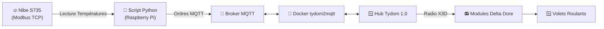

# 🏡 Automatisateur Nibe S735 & Delta Dore (Tydom)

Un petit projet domotique fluide et autonome pour faire communiquer une pompe à chaleur **Nibe S735** avec des volets roulants motorisés pilotés par des modules radio **Delta Dore (Tydom 1.0)** via MQTT.

L'objectif est simple : garder la maison au frais l'été (et confortable le reste de l'année) en fermant automatiquement les volets lors des pics de chaleur, tout en vous laissant le contrôle manuel à tout moment.

---

## 💡 Comment ça marche ?

Le système fonctionne en tâche de fond (sur un Raspberry Pi ou un serveur Linux) :

1. **Il lit les températures de la Nibe S735** (sonde extérieure et sonde d'ambiance) en Modbus TCP.
2. **Il décide de l'action** à mener (fermeture en cas de canicule, ouverture quand l'air se rafraîchit, ou ouverture programmée le soir).
3. **Il communique via MQTT** avec le conteneur Docker `tydom2mqtt`, qui transmet les ordres radio X3D aux modules Delta Dore commandant vos volets.



---

## ✨ Ce que fait le script pour vous

* 🌅 **Lever du soleil (+5 min)** : Ouverture automatique de tous les volets 5 minutes après le lever du soleil.
* 🌇 **Coucher du soleil (+5 min)** : Fermeture automatique de tous les volets 5 minutes après le coucher du soleil.
* ☀️ **Protection intelligente anti-chaleur** : Si la température extérieure dépasse **25 °C** ou si l'intérieur monte à **23.5 °C**, les volets ne se ferment **que si le ciel est ensoleillé (soleil direct)**. Si le ciel est très couvert ou pluvieux, les volets restent ouverts pour profiter de la lumière naturelle.
* 🍃 **Ouverture automatique** : Lorsque la température extérieure redescend sous **21 °C**, les volets s'ouvrent à nouveau.
* 🤝 **Respect de l'utilisateur** : Le script mémorise ses actions dans un fichier `shutter_state.json`. S'il a déjà fermé un volet et que vous l'ouvrez manuellement, il ne viendra pas vous contredire !
* 🔄 **Support des câblages inversés** : Option `INVERT_COVER_WIRING` intégrée si le câblage électrique de vos volets vers le module est inversé (`UP` = fermeture).

---

## 🚀 Prise en main rapide

> 📖 **Pour le guide pas-à-pas complet d'installation sur Raspberry Pi**, consultez [install.md](install.md).

### 1. Préparer l'environnement Docker

Copiez le fichier de configuration exemple et ajustez vos accès :

```bash
cp docker-compose.yml.example docker-compose.yml
```

Modifiez `docker-compose.yml` avec l'adresse IP de votre box Tydom et vos identifiants Cloud Delta Dore, puis lancez le service :

```bash
docker-compose up -d
```

### 2. Installer les dépendances Python

Sur le Raspberry Pi ou votre serveur :

```bash
sudo apt install -y python3-pymodbus python3-paho-mqtt
```

### 3. Découvrir vos volets & adapter vos scripts (`VOLETS`)

Chaque installation domotique possède ses propres noms et identifiants de volets. Pour adapter le projet à votre installation :

1. **Lancez la découverte automatique** sur votre Raspberry Pi :
   ```bash
   python3 test_volet.py discover
   ```
   Le script va scruter votre réseau MQTT et vous afficher directement le dictionnaire Python prêt à l'emploi, par exemple :
   ```python
   VOLETS = {
       "salon": "1762458154_1762458154",
       "bureau": "1762458846_1762458846",
       "cuisine": "1762459305_1762459305",
       "chambre": "1762459622_1762459622",
   }
   ```
2. **Copiez-collez ce dictionnaire** dans vos fichiers `test_volet.py` et `nibe_shutter_control.py`.

### 4. Tester et lancer la régulation

* **Diagnostics PAC Nibe** : `python3 tempread.py` (affiche les températures de la PAC).
* **Test individuel d'un volet** :
  ```bash
  python3 test_volet.py bureau close   # Ferme le volet du bureau
  python3 test_volet.py salon open     # Ouvre le volet du salon
  ```
* **Lancer la régulation automatique** : `python3 nibe_shutter_control.py`

---

## ⏰ Automatisation avec Cron

Pour laisser le Raspberry Pi gérer tout ça silencieusement, ajoutez une tâche Cron (par exemple toutes les 5 minutes) avec `crontab -e` :

```crontab
*/5 * * * * python3 /home/pi/nibe/nibe_shutter_control.py > /dev/null 2>&1
```

---

## 🛠️ Astuces & Dépannage

* **Un seul accès à la fois sur Tydom 1.0** : La box Tydom n'autorise qu'une seule connexion active à la fois. Pensez à couper `tydom2mqtt` sur votre PC de test avant de le démarrer sur le Raspberry Pi !
* **Broker Mosquitto** : Pensez à autoriser les connexions du réseau Docker en créant `/etc/mosquitto/conf.d/local.conf` avec `listener 1883` et `allow_anonymous true`.

Bonne automatisation ! 🌿
