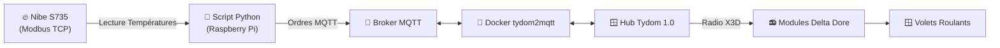

# 🏡 Automatisateur Nibe S735 & Delta Dore (Tydom)

Un petit projet domotique fluide et autonome pour faire communiquer une pompe à chaleur **Nibe S735** avec des volets roulants motorisés pilotés par des modules radio **Delta Dore (Tydom 1.0)** via MQTT.

L'objectif est simple : garder la maison au frais l'été (et confortable le reste de l'année) en fermant automatiquement les volets lors des pics de chaleur, tout en vous laissant le contrôle manuel à tout moment.

---

## 💡 Comment ça marche ?

Le système fonctionne en tâche de fond (sur un Raspberry Pi ou un serveur Linux) :

1. **Il lit les températures de la Nibe S735** (sonde extérieure et sonde d'ambiance) en Modbus TCP.
2. **Il décide de l'action** à mener (fermeture en cas de canicule, ouverture quand l'air se rafraîchit, ou ouverture programmée le soir).
3. **Il communique via MQTT** avec le conteneur Docker `tydom2mqtt`, qui transmet les ordres radio X3D aux modules Delta Dore commandant vos volets.



---

## ✨ Ce que fait le script pour vous

* 🌅 **Lever du soleil (+5 min)** : Ouverture automatique de tous les volets (en mode Présent comme en mode Absent).
* 🌇 **Coucher du soleil (+5 min)** : Fermeture automatique de tous les volets **uniquement en mode Absent** (détecté via le registre Nibe 137). En mode Présent, la fermeture nocturne est ignorée pour laisser la main aux occupants.
* 📊 **Température instantanée & Lissage solaire 1h** : La température extérieure réelle Nibe (BT1) est lue sans retard, tandis que la couverture nuageuse est lissée sur une moyenne glissante de 1 heure (12 échantillons à 5 min d'intervalle) pour neutraliser l'effet des nuages temporaires.
* 🛡️ **Préservation des moteurs (Cadence paramétrable)** : Les ordres physiques de mouvement vers les moteurs ne sont envoyés qu'au maximum toutes les **30 minutes** (`DELAI_MINIMUM_MOTEUR_MINUTES = 30`), préservant les moteurs de volets.
* ☀️ **Protection anti-chaleur progressive & Filtrage d'Azimut** : La protection solaire s'active lorsque le soleil est orienté vers les façades ciblées (Azimut entre **85° et 240°**, soit de ~09h00 à ~16h45 avec marge de sécurité, et élévation $\ge 10^\circ$). Dès 16h45, lorsque le soleil passe derrière la maison, les volets s'ouvrent à 100%.
* 🔥 **Mode Canicule Conductif ($T_\text{ext} > 28\ ^\circ\text{C}$)** : Lorsque la température extérieure dépasse **28 °C**, une fermeture conductive de protection s'applique **exclusivement aux volets de la liste ciblée** (`salon`, `bureau`). Les autres volets (`cuisine`, etc.) restent **100% ouverts** en journée pour garantir la lumière naturelle indispensable aux plantes d'intérieur.
* 🍃 **Ouverture automatique** : Lorsque la température extérieure redescend sous **21 °C**, les volets s'ouvrent à nouveau.
* 📈 **Anticipation thermique par dérivée ($dT/dt$)** : Calcul de la vitesse de variation de $T_\text{ext}$ sur 15 min (3 échantillons) avec transformation quadratique ($v^2$) pour anticiper préventivement les fortes montées en température.
* 🤝 **Respect de l'utilisateur** : Le script mémorise ses actions dans un fichier `shutter_state.json`. S'il a déjà fermé un volet et que vous l'ouvrez manuellement, il ne viendra pas vous contredire !
* 🔄 **Support des câblages inversés** : Option `INVERT_COVER_WIRING` intégrée si le câblage électrique de vos volets vers le module est inversé (`UP` = fermeture).

---

## 🚀 Prise en main rapide

> 📖 **Pour le guide pas-à-pas complet d'installation sur Raspberry Pi**, consultez [install.md](install.md).

### 1. Préparer l'environnement Docker

Copiez le fichier de configuration exemple et ajustez vos accès :

```bash
cp docker-compose.yml.example docker-compose.yml
```

Modifiez `docker-compose.yml` avec l'adresse IP de votre box Tydom et vos identifiants Cloud Delta Dore, puis lancez le service :

```bash
docker-compose up -d
```

### 2. Installer les dépendances Python

Sur le Raspberry Pi ou votre serveur :

```bash
sudo apt install -y python3-pymodbus python3-paho-mqtt
```

### 3. Découvrir vos volets & adapter vos scripts (`VOLETS`)

Chaque installation domotique possède ses propres noms et identifiants de volets. Pour adapter le projet à votre installation :

1. **Lancez la découverte automatique** sur votre Raspberry Pi :
   ```bash
   python3 test_volet.py discover
   ```
   Le script va scruter votre réseau MQTT et vous afficher directement le dictionnaire Python prêt à l'emploi, par exemple :
   ```python
   VOLETS = {
       "salon": "1762458154_1762458154",
       "bureau": "1762458846_1762458846",
       "cuisine": "1762459305_1762459305",
       "chambre": "1762459622_1762459622",
   }
   ```
2. **Copiez-collez ce dictionnaire** dans vos fichiers `test_volet.py` et `nibe_shutter_control.py`.

### 4. Tester et lancer la régulation

* **Diagnostics PAC Nibe** : `python3 tempread.py` (affiche les températures de la PAC).
* **Test individuel d'un volet** :
  ```bash
  python3 test_volet.py bureau close   # Ferme le volet du bureau
  python3 test_volet.py salon open     # Ouvre le volet du salon
  ```
* **Lancer la régulation automatique** : `python3 nibe_shutter_control.py`

### 5. Démarrer le Serveur Web d'Historique

Pour consulter l'historique des températures et des ouvertures de volets sur votre réseau local :

```bash
python3 server.py
```

Ouvrez ensuite votre navigateur sur **`http://<IP_DU_RASPBERRY>:8080`** (ou `http://raspberrypi.local:8080`).

---

## 🌐 Serveur Web & Historique SQLite

Un serveur web autonome ultra-léger et zéro dépendance est inclus (`server.py`). Il enregistre à chaque passage de la régulation (`nibe_shutter_control.py`) une ligne dans la base SQLite locale `history.db`.

Le tableau de bord interactif vous permet de :
* 🌡️ Visualiser les courbes de températures extérieure (Nibe BT1) et intérieure (Nibe BT50).
* 🌤️ Suivre la couverture nuageuse et l'azimut/élévation du soleil.
* 🪟 Suivre l'historique de fermeture/ouverture de tous vos volets (Salon, Bureau, Cuisine, Chambre...).
* ⚡ Consulter le journal horodaté des ordres envoyés à Tydom via MQTT.

---

## ⏰ Automatisation avec Cron & Systemd

1. **Régulation toutes les 5 minutes (`crontab -e`)** :
   ```crontab
   */5 * * * * python3 /home/pi/nibe/nibe_shutter_control.py > /dev/null 2>&1
   ```

2. **Serveur Web en tâche de fond (Service systemd)** :
   Consultez [install.md](install.md) pour créer le service `dominibe-web.service`.

---

## 🛠️ Astuces & Dépannage

* **Un seul accès à la fois sur Tydom 1.0** : La box Tydom n'autorise qu'une seule connexion active à la fois. Pensez à couper `tydom2mqtt` sur votre PC de test avant de le démarrer sur le Raspberry Pi !
* **Broker Mosquitto** : Pensez à autoriser les connexions du réseau Docker en créant `/etc/mosquitto/conf.d/local.conf` avec `listener 1883` et `allow_anonymous true`.

Bonne automatisation ! 🌿


---

## 🧠 Logique de Régulation Thermique

Le moteur (`engine.py`) applique **trois couches de régulation** lors de chaque cycle cron, dont le résultat final est le `max()` de chaque taux de fermeture calculé.

### Couche 1 — Protection Solaire (T° extérieure)

Fermeture progressive des volets exposés (`VOLETS_PROTECTION_CHALEUR`) basée sur la progression de la température extérieure entre `SEUIL_TEMP_EXT_BASSE` et `SEUIL_TEMP_EXT_HAUTE`. L'ensoleillement est lissé sur 1 heure.

| Variable | Défaut | Description |
|---|---|---|
| `SEUIL_TEMP_EXT_BASSE` | `21.0 °C` | Seuil bas : volets ouverts |
| `SEUIL_TEMP_EXT_HAUTE` | `25.0 °C` | Seuil haut : fermeture maximale |

### Couche 2 — Protection Canicule (T° ext > 28°C)

Au-dessus de 28°C, fermeture progressive des volets canicule (`VOLETS_PROTECTION_CANICULE`) même à l'ombre, pour limiter la conduction thermique.

### Couche 3 — Régulation par Cible DNI (Transmittance Proportionnelle)

Pilotage des volets exposés pour maintenir une irradiance transmise inférieure à une cible, limitant le gain thermique solaire direct sans couper la lumière inutilement.

**Formule :**
```
fermeture_DNI = 1 - (DNI_CIBLE / DNI_mesuré)
```

Par exemple, avec `DNI = 700 W/m²` et `DNI_CIBLE = 550 W/m²` → fermeture de **21%**.

**Conditions d'activation :** les trois doivent être vraies simultanément :
1. La façade est exposée au soleil direct (azimut et élévation dans la fenêtre)
2. La température intérieure `t_int > DNI_TEMP_INT_SEUIL` (22.0°C par défaut) — activation préventive avant que la chaleur ne soit trop ressentie
3. `solar_dni > DNI_CIBLE + DNI_HYST` (600 W/m² par défaut)

**Hystérésis :** si le DNI est entre `DNI_CIBLE` et `DNI_CIBLE + DNI_HYST`, le taux précédent est maintenu pour éviter les oscillations toutes les 5 minutes.

| Variable d'environnement | Défaut | Description |
|---|---|---|
| `DNI_CIBLE` | `550.0` W/m² | Irradiance transmise maximale souhaitée |
| `DNI_HYST` | `50.0` W/m² | Marge d'hystérésis (activation à cible+hyst, désactivation à cible) |
| `DNI_TEMP_INT_SEUIL` | `22.0` °C | Température intérieure minimale pour activer la régulation DNI |

> **Note :** `DNI_TEMP_INT_SEUIL` (22°C) est intentionnellement plus bas que `SEUIL_TEMP_INT_HAUTE` (23.5°C) pour déclencher une protection préventive avant que la chaleur ne devienne inconfortable.

Ces deux valeurs peuvent également être modifiées directement dans `nibe_shutter_control.py`.

> **Référence :** cette approche est analogue à l'objet `WindowProperty:ShadingControl` mode `OnIfHighSolarOnWindow` d'EnergyPlus, et correspond au niveau de régulation A de la norme EN 15232 (EPBD).

### Auto-vérification de la logique DNI

```bash
python3 test_dni.py
```

Ce script vérifie les 5 cas limites (fermeture nominale, t_int trop basse, DNI sous cible, hystérésis, façade non exposée) sans aucune dépendance externe.

